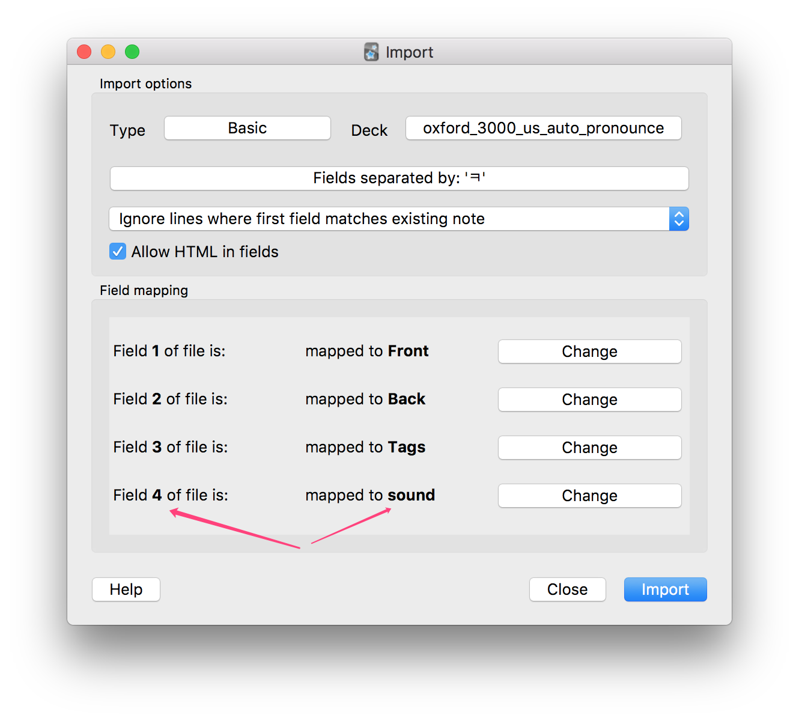

# Oxford 3000 (us) to Anki

## 百度云下载

[链接：https://pan.baidu.com/s/1nv3GZ7z](https://pan.baidu.com/s/1nv3GZ7z)

- 如何动手打造属于自己的ANKI牌组（编程向）之牛津基本三千词.pdf

- 牛津三千词-带美式发音-带完整释义-词典源是牛津学习者初级词典-正序-制作者acbetter@github-170729.apkg
- **[不推荐使用]**牛津三千词-带美式发音-带完整释义-词典源是牛津学习者初级词典-正序-制作者acbetter@github-170902-**自动发音但缺失部分发音**.apkg（详见已知问题）

## 已知问题

- AnkiDroid 导入失败

  - 把 `*.apkg` 重命名为`oxford_3000_us.apkg`
  - 下载`collection.media` `z_oxford_3000.css` `z_oxford_3000.txt`三个文件自行编译打包

- 不能自动发音

  - 这个问题已经在 170902 这个版本中得到了解决

    1. 删除原来的`Desk`

    2. 按照下图的格式导入我新制作的`z_oxford_auto_pronounce.txt`

       

    3. 这样就可以既能鼠标点击发音按钮，发出不同的声音；也可以自动发音，默认是每个单词的第一个音频。**需要注意的是，这种方法在导出的时候，无法导出所有的音频文件，只能导出每个单词的第一个音频。**这是因为，在把`Field 4`设定为`sound`时，`Field 4`只有一个音频，而`Anki`不会导出`Field 3`的音频。

    4. 我导出了这份**自动发音但缺失部分发音**的包并放到了百度云里，但是如果想要完美解决这个问题只能参照步骤 1、2、3。